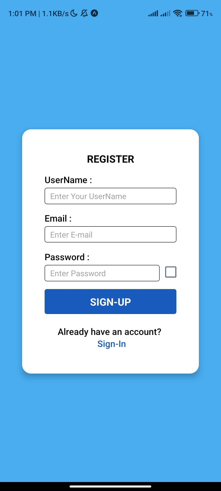
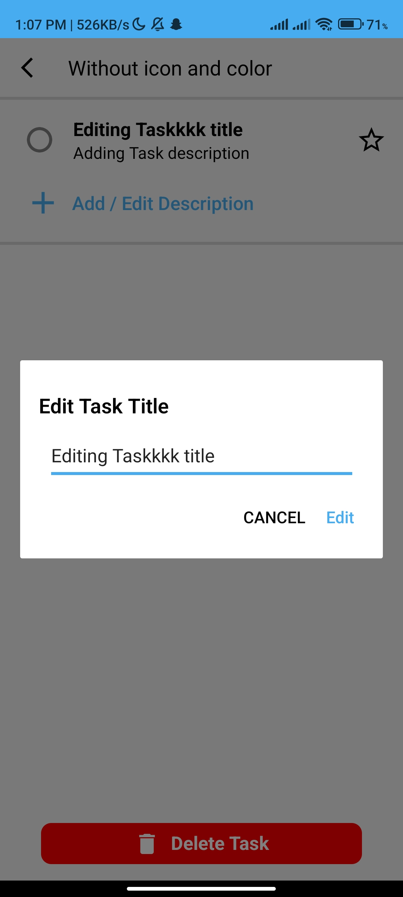
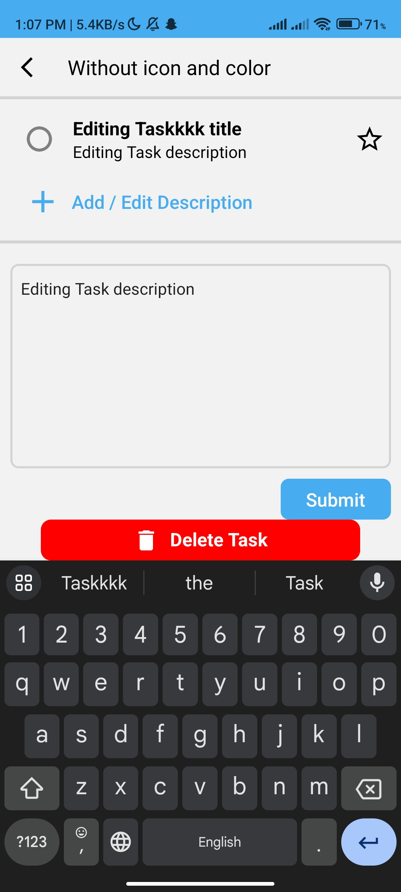

<h1 align="left">Hey 👋 What's up?</h1>

###

<h3 align="left">This is Microsoft To-do List Application</h3>

###

<h2 align="left">About The Application:</h2>

###

Mobile Application Using React Native and Redux TLK and Expo.

###

<h2 align="left">Photos Of the App</h2>

###

https://drive.google.com/drive/folders/1N1aTZzXH_yzThQiShFPYA1gb-EYtXoLO?usp=drive_link

  

    
    
    
    
  

  

    
    
    
    
  

  

    
    
    
    
  

  

    
    
    
    
  

  

    
    
    
    
  

  

    
    
    
    
  

  

    
    
    
    
  

  

    
    
    
    
  

  

    
    
  

###

<h2 align="left">Video Of the Application</h2>

###

https://drive.google.com/file/d/1N3GYUPPuOZXNJzn9Zj0WHy1VvRC7gpgH/view?usp=drive_link

###

  
  
  
  
  
  
  
  
  
  
  
  
  
  
  
  
  
  
  

###
